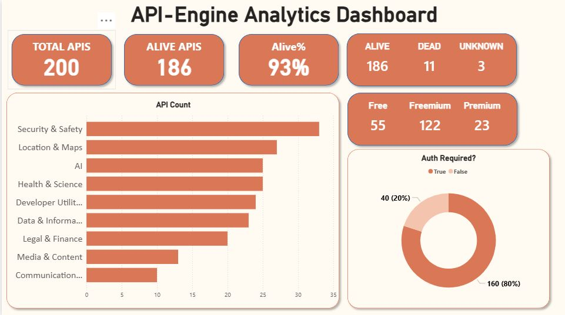

## PowerBI  API-Engine Dashboard

Developed a dynamic, living dashboard in PowerBI by connecting my own API listing JSON dataset. This work extends the analytics side of the API-Engine project.

The JSON data is sourced directly from GitHub and updates daily, allowing the dashboard to automatically reflect the latest data without manual intervention.

This enables continuous monitoring of API trends, categories, and usage insights in real time through an interactive and data-driven interface.

**Source:** https://raw.githubusercontent.com/germanter/apiEngine/refs/heads/main/api.json