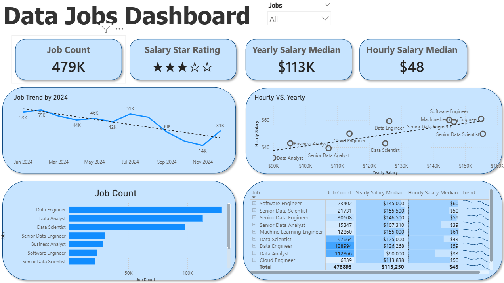
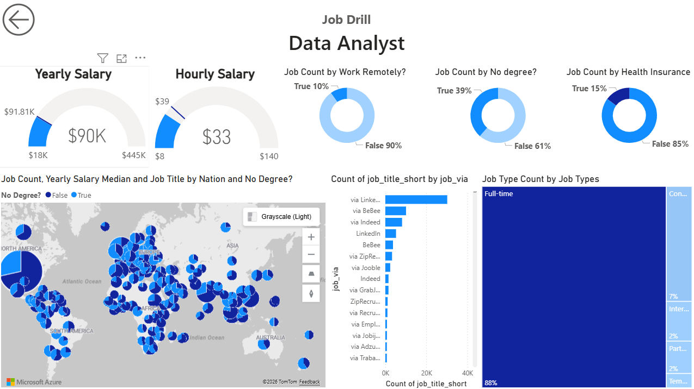

# Data Jobs Dashboard (Power BI)

A concise Power BI study project visualizing **400K+ job records** with interactive insights.

## Overview
This dashboard presents job market data with a focus on:
- Country-based categorization
- Job counts and distributions
- Detailed drill-through analysis

## Features
- Interactive visuals for exploring large-scale job data
- Drill-through functionality for deeper insights
- Clean and simple layout for quick understanding

## Preview

## Purpose
Built as a study project to practice data visualization, data modeling, and dashboard design in Power BI.