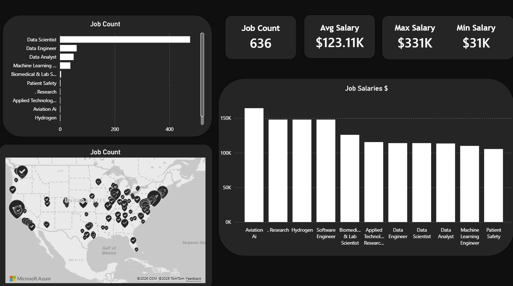

# Data Science Job Postings - Data Cleaning & Visualization Project

This project focuses on transforming a raw, highly unorganized, and "noisy" dataset of data science job postings into a structured, clean format ready for professional business intelligence. The data engineering phase was handled entirely in **Python (Pandas & Regex)**, and the final interactive analysis was built using **Power BI**.

---

## 🚀 Overview

- **Source Data:** I extracted the raw, messy dataset directly from GitHub:  
  `https://raw.githubusercontent.com/eyowhite/Messy-dataset/refs/heads/main/Uncleaned_DS_jobs.csv`
- **The Challenge:** The raw data contained massive noise, including broken scraping characters (`–`), mixed company names inside job titles, random shift times, locations attached to unvons, and chaotic seniority formats (e.g., *“Health Plan Data Analyst, Sr”*, *“Data Scientist 3 (718)”*, *“Sr. ML/Data Scientist - AI/NLP/Chatbot”*).
- **The Solution:** By applying automated custom regex sanitizers and hierarchical mappings in Python, the chaotic titles were successfully grouped into standardized market roles (*Data Scientist*, *Data Engineer*, *Data Analyst*, *Machine Learning Engineer*, etc.), allowing Power BI to generate an accurate, pristine executive dashboard.

---

## 📊 Dashboard Preview

Below is the final interactive report showcasing key metrics, clean role distributions, geographical job density across the United States, and strict salary brackets:



---

## ⚙️ Project Pipeline

1. **Advanced Text Sanitization (Regex):**
   - Stripping out job metadata, scraping artifacts, dates, and security clearances (e.g., `TS/SCI`).
   - Removing attached location strings, company suffixes, and custom shift schedules.
   - Removing seniority noise (`Sr`, `Jr`, `Lead`, `II`, `III`) to extract the absolute core profession.
2. **Hierarchical Categorization:** Mapping messy roles into standardized, high-level job functions based on dominant industry keywords.
3. **BI & Analytics:** Importing the finalized `.csv` into Power BI to construct metric cards, a geographic distribution map, and salary breakdown charts.

---

## 🛠️ Tech Stack & Dependencies

The processing script relies on standard Python data science libraries. 

All dependencies required to execute the pipeline are listed in `req.txt`. You can install them by running:

```bash
pip install -r req.txt